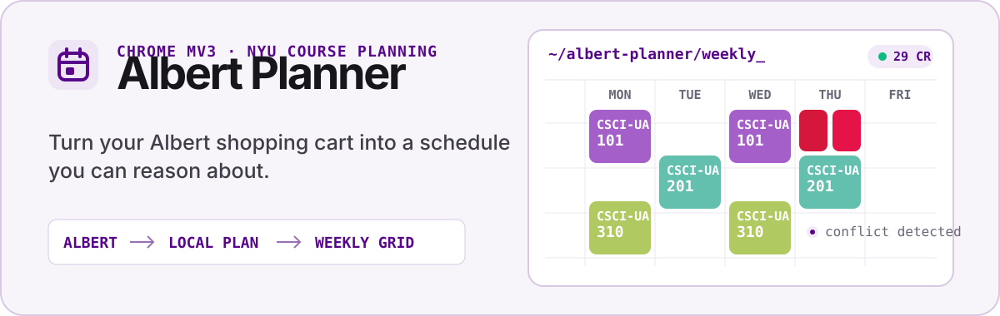
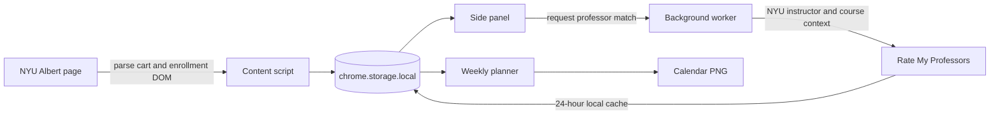

<p align="center">
  
</p>

<p align="center">
  <a href="https://chromewebstore.google.com/detail/albert-planner/lndleikbfacmkakhcfflpgnlapoekmoa"></a>
  
  
  <a href="./LICENSE"></a>
</p>

<p align="center">
  <a href="#what-it-gives-you">Features</a> ·
  <a href="#how-it-works">How it works</a> ·
  <a href="#install">Install</a> ·
  <a href="#development">Development</a> ·
  <a href="#privacy">Privacy</a>
</p>

<p align="center">
  
  <br>
  <sub>Side panel and weekly planner rendered with representative local test data.</sub>
</p>

> Albert Planner is an independent open-source project. It is not affiliated with or endorsed by New York University or Rate My Professors.

## What it gives you

Albert Planner turns the course information already visible in Albert into one local planning workspace:

- **Reliable Albert import** — reads courses, sections, credits, instructors, rooms, statuses, and meeting times from the Shopping Cart and enrollment summary.
- **A schedule you can inspect** — lays planned courses onto a five-day calendar with credit totals, weekly hours, earliest and latest meetings, and PNG export.
- **Visible tradeoffs** — highlights overlapping classes and flags components whose meeting time is still TBA.
- **Flexible priorities** — organizes courses into Required, High, Medium, Low, Backup, or custom drag-and-drop buckets.
- **Professor context** — matches NYU instructors with Rate My Professors data using name, department, course code, and rating history.
- **Local-first data** — keeps courses, buckets, settings, and cached ratings in `chrome.storage.local`; there is no Albert Planner account or backend.

## How it works



The content script only runs on NYU SIS hosts. The background service worker owns extension events, side-panel access, context menus, and cached professor lookups. The side panel and weekly view read the same local planner state, so changes stay synchronized across surfaces.

## Install

### Chrome Web Store

Install [Albert Planner from the Chrome Web Store](https://chromewebstore.google.com/detail/albert-planner/lndleikbfacmkakhcfflpgnlapoekmoa), then open an NYU Albert Shopping Cart or enrollment summary page.

1. Select the Albert Planner icon or the in-page `~/planner →` control.
2. Choose **fetch from albert** to import the active term.
3. Organize courses into buckets and open **calendar** to build the weekly plan.

Albert Planner supports Chrome and Chromium browsers that implement Manifest V3 and the Side Panel API.

### Load an unpacked build

Requirements: [Node.js](https://nodejs.org/) with Corepack and a Chromium-based browser.

```bash
git clone https://github.com/Bruscheto/Albert-Planner.git
cd Albert-Planner
corepack pnpm install
corepack pnpm build
```

Open `chrome://extensions`, enable **Developer mode**, choose **Load unpacked**, and select the generated `dist/` directory. WXT creates `dist/manifest.json`; the repository root is not a loadable extension.

## Development

```bash
corepack pnpm install
corepack pnpm dev
```

| Command | Purpose |
| --- | --- |
| `corepack pnpm dev` | Start WXT in development mode |
| `corepack pnpm test` | Run parser, storage, planner, metadata, schedule, and RMP matcher tests |
| `corepack pnpm build` | Create the production extension in `dist/` |
| `corepack pnpm zip` | Package the extension for distribution |

### Project structure

```text
Albert-Planner/
├── assets/                 Extension icons
├── docs/assets/            README visuals
├── entrypoints/            WXT background, content, popup, and weekly-view entries
├── src/
│   ├── background/         Service worker, messaging, side panel, and context menus
│   ├── content/            Albert DOM intake and in-page launcher
│   ├── metadata/           Course and professor detail panels
│   ├── planner/            Schedule analysis and priority ordering
│   ├── popup/              Side-panel course and bucket management
│   ├── rmp/                NYU professor matching and rating lookup
│   ├── shared/             Time, calendar, constants, and browser-test utilities
│   ├── storage/            Local course, bucket, rating, and settings persistence
│   └── weekly-view/        Calendar grid, conflicts, drag and drop, and PNG export
├── test/                   Node-based unit and integration tests
├── test-harness.html       Local UI harness with representative course data
└── wxt.config.js           Manifest V3 permissions and build configuration
```

## Privacy

Course and planner data stays in the browser. Professor lookups send an instructor name and course context to Rate My Professors; no Albert Planner server receives user data. See the full [privacy policy](./PRIVACY.md) for permissions, third-party requests, and deletion details.

## Contributing

Issues and focused pull requests are welcome. Before opening one, run:

```bash
corepack pnpm test
corepack pnpm build
```

## License

Albert Planner is available under the [MIT License](./LICENSE).
