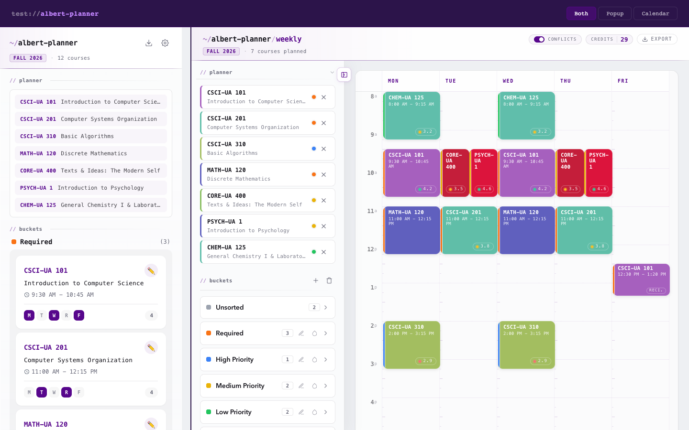
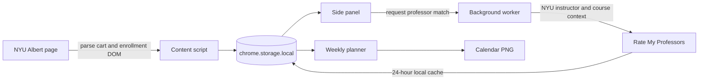

<div align="center">
  

  # Albert Planner

  **Turn your NYU Albert shopping cart into a schedule you can reason about.**

  Parse courses directly from Albert, organize priorities, compare professor ratings,
  spot conflicts, and build a weekly plan without leaving your browser.

  [](https://chromewebstore.google.com/detail/albert-planner/lndleikbfacmkakhcfflpgnlapoekmoa)
  
  
  [](./LICENSE)

  [Install](#install) · [Features](#features) · [Development](#development) · [Privacy](#privacy)
</div>



> Albert Planner is an independent open-source project. It is not affiliated with or endorsed by New York University or Rate My Professors.

## Features

<table>
  <tr>
    <td width="33%"><strong>Albert import</strong><br>Reads courses, sections, credits, instructors, rooms, statuses, and meeting times from Albert's Shopping Cart and enrollment summary.</td>
    <td width="33%"><strong>Weekly planner</strong><br>Builds a five-day calendar with credit totals, campus-time statistics, and an exportable PNG.</td>
    <td width="33%"><strong>Conflict detection</strong><br>Highlights overlapping classes and flags components whose meeting time is still TBA.</td>
  </tr>
  <tr>
    <td><strong>Priority buckets</strong><br>Sorts courses into Required, High, Medium, Low, Backup, or custom buckets with drag and drop.</td>
    <td><strong>Professor context</strong><br>Matches NYU instructors with Rate My Professors data using name, department, course code, and rating history.</td>
    <td><strong>Local-first storage</strong><br>Keeps course and planner data in <code>chrome.storage.local</code>; there is no Albert Planner account or backend.</td>
  </tr>
</table>

## Install

### Chrome Web Store

Install [Albert Planner from the Chrome Web Store](https://chromewebstore.google.com/detail/albert-planner/lndleikbfacmkakhcfflpgnlapoekmoa), then open an NYU Albert Shopping Cart or enrollment summary page.

1. Select the Albert Planner icon or the in-page `~/planner →` control.
2. Choose **fetch from albert** to import the active term.
3. Organize courses into buckets and open **calendar** to build the weekly plan.

Albert Planner supports Chrome and other Chromium browsers that implement Manifest V3 and the Side Panel API.

### Load an unpacked build

Requirements: [Node.js](https://nodejs.org/) with Corepack and a Chromium-based browser.

```bash
git clone https://github.com/Bruscheto/Albert-Planner.git
cd Albert-Planner
corepack pnpm install
corepack pnpm build
```

Open `chrome://extensions`, enable **Developer mode**, choose **Load unpacked**, and select the generated `dist/` directory. WXT creates `dist/manifest.json`; the repository root is not a loadable extension.

## How it works



The content script only runs on NYU SIS hosts. The background service worker owns extension events, side-panel access, context menus, and cached professor lookups. The popup and weekly view read the same local planner state, so changes remain synchronized across surfaces.

## Development

```bash
corepack pnpm install
corepack pnpm dev
```

WXT starts the development build and watches source changes. Use these commands for the main workflows:

| Command | Purpose |
| --- | --- |
| `corepack pnpm dev` | Start WXT in development mode |
| `corepack pnpm test` | Run parser, storage, planner, metadata, schedule, and RMP matcher tests |
| `corepack pnpm build` | Create the production extension in `dist/` |
| `corepack pnpm zip` | Package the extension for distribution |

### Project structure

```text
Albert-Planner/
├── assets/                 Extension icons
├── docs/assets/            README media
├── entrypoints/            WXT background, content, popup, and weekly-view entries
├── src/
│   ├── background/         Service worker, messaging, side panel, and context menus
│   ├── content/            Albert DOM intake and in-page launcher
│   ├── metadata/           Course and professor detail panels
│   ├── planner/            Schedule analysis and priority ordering
│   ├── popup/              Side-panel course and bucket management
│   ├── rmp/                NYU professor matching and rating lookup
│   ├── shared/             Time, calendar, constants, and browser-test utilities
│   ├── storage/            Local course, bucket, rating, and settings persistence
│   └── weekly-view/        Calendar grid, conflicts, drag and drop, and PNG export
├── test/                   Node-based unit and integration tests
├── test-harness.html       Local UI harness with representative course data
└── wxt.config.js           Manifest V3 permissions and build configuration
```

## Privacy

Course and planner data stays in the browser. Professor lookups send an instructor name and course context to Rate My Professors; no Albert Planner server receives user data. See the full [privacy policy](./PRIVACY.md) for permissions, third-party requests, and deletion details.

## Contributing

Issues and focused pull requests are welcome. Before opening a pull request, run:

```bash
corepack pnpm test
corepack pnpm build
```

## License

Albert Planner is available under the [MIT License](./LICENSE).
