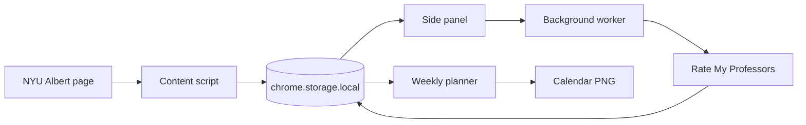

<p align="center">
  
</p>

<p align="center">
  <a href="https://chromewebstore.google.com/detail/albert-planner/lndleikbfacmkakhcfflpgnlapoekmoa"></a>
  
  
  <a href="./LICENSE"></a>
</p>

<p align="center">
  <a href="#features">Features</a> ·
  <a href="#install">Install</a> ·
  <a href="#development">Development</a> ·
  <a href="#privacy">Privacy</a>
</p>

Albert Planner is a Chrome extension for NYU students. It imports course data from Albert and helps you compare weekly schedules.

<p align="center">
  
  <br>
  <sub>The side panel and weekly planner use local test data in this preview.</sub>
</p>

> Albert Planner is an independent open-source project. NYU and Rate My Professors do not sponsor or endorse it.

## Features

- Import courses from the Albert Shopping Cart or enrollment summary.
- Organize courses into priority buckets.
- View classes on a five-day calendar.
- Find schedule conflicts and courses with unknown meeting times.
- Compare credit totals, weekly hours, and meeting times.
- View Rate My Professors data for matched instructors.
- Export the weekly schedule as a PNG file.
- Store planner data in the browser.

## How it works



The content script reads the active Albert page. It stores imported courses in `chrome.storage.local`.

The side panel and weekly planner use the same stored data. The background worker handles professor lookups and caches the results.

## Install

### Chrome Web Store

1. Install [Albert Planner from the Chrome Web Store](https://chromewebstore.google.com/detail/albert-planner/lndleikbfacmkakhcfflpgnlapoekmoa).
2. Open an Albert Shopping Cart or enrollment summary page.
3. Select the Albert Planner icon or the `~/planner →` control.
4. Select **fetch from albert**.
5. Organize the imported courses.
6. Open **calendar** to view the weekly schedule.

Albert Planner requires Chrome or a Chromium browser with the Side Panel API.

### Local build

You need [Node.js](https://nodejs.org/) with Corepack and a Chromium browser.

```bash
git clone https://github.com/Bruscheto/Albert-Planner.git
cd Albert-Planner
corepack pnpm install
corepack pnpm build
```

1. Open `chrome://extensions`.
2. Enable **Developer mode**.
3. Select **Load unpacked**.
4. Select the generated `dist/` directory.

Load `dist/`, not the repository root. WXT creates the extension manifest in `dist/`.

## Development

Run the extension in development mode:

```bash
corepack pnpm install
corepack pnpm dev
```

| Command | Purpose |
| --- | --- |
| `corepack pnpm dev` | Start the WXT development server |
| `corepack pnpm test` | Run the project tests |
| `corepack pnpm build` | Create the extension in `dist/` |
| `corepack pnpm zip` | Create a distribution package |

WXT uses Vite for the development and production builds.

### Project structure

```text
Albert-Planner/
├── assets/                 Extension icons
├── docs/assets/            README images
├── entrypoints/            WXT extension entry points
├── src/
│   ├── background/         Events, messages, and professor lookups
│   ├── content/            Albert page import
│   ├── metadata/           Course and professor details
│   ├── planner/            Schedule analysis and priorities
│   ├── popup/              Side panel interface
│   ├── rmp/                Professor matching
│   ├── shared/             Shared utilities
│   ├── storage/            Local planner data
│   └── weekly-view/        Calendar and PNG export
├── test/                   Project tests
├── test-harness.html       Local interface preview
└── wxt.config.js           Extension configuration
```

## Privacy

Albert Planner stores course and planner data in `chrome.storage.local`. It does not send this data to an Albert Planner server.

Professor lookups send an instructor name and course context to Rate My Professors. See the [privacy policy](./PRIVACY.md) for more details.

## Contributing

Before you open a pull request, run:

```bash
corepack pnpm test
corepack pnpm build
```

## License

Albert Planner uses the [MIT License](./LICENSE).
