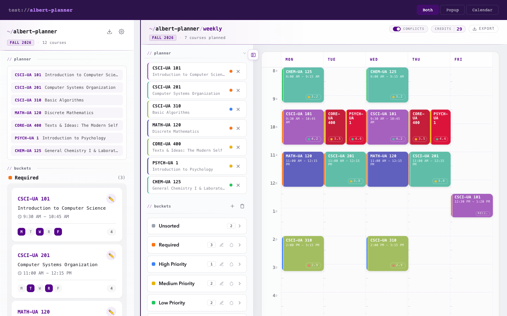
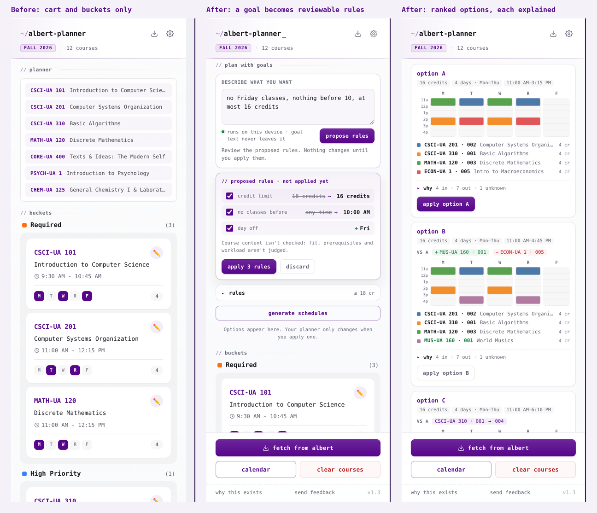
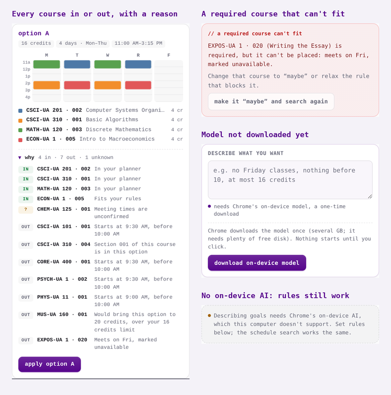
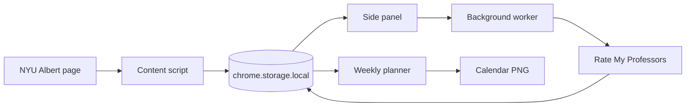

<p align="center">
  
</p>

<p align="center">
  <a href="https://chromewebstore.google.com/detail/albert-planner/lndleikbfacmkakhcfflpgnlapoekmoa"></a>
  
  
  <a href="./LICENSE"></a>
</p>

<p align="center">
  <a href="#features">Features</a> ·
  <a href="#install">Install</a> ·
  <a href="#development">Development</a> ·
  <a href="#privacy">Privacy</a>
</p>

Albert Planner is a Chrome extension for NYU students. It imports course data from Albert and helps you compare weekly schedules.

<p align="center">
  
  <br>
  <sub>The side panel and weekly planner use local test data in this preview.</sub>
</p>

> Albert Planner is an independent open-source project. NYU and Rate My Professors do not sponsor or endorse it.

## Features

- Import courses from the Albert Shopping Cart or enrollment summary.
- Organize courses into priority buckets.
- View classes on a five-day calendar.
- Find schedule conflicts and courses with unknown meeting times.
- Compare credit totals, weekly hours, and meeting times.
- View Rate My Professors data for matched instructors.
- Export the weekly schedule as a PNG file.
- Store planner data in the browser.
- Plan with goals: set rules (credit limit, earliest start, days off, must or skip per section) or describe a goal in plain language. Chrome's built-in model proposes rules on your device, and nothing changes until you review and apply them.
- Get up to three ranked schedule options from a complete search over your cart's sections, with a reason for every course that was left out.

### Plan with goals

The **plan with goals** section of the side panel turns a goal such as "no Friday classes, nothing before 10, at most 16 credits" into proposed rules. Each proposed change is shown against your current rules and can be kept or dropped before you apply it.

- **On-device only.** Goals are read by Chrome's built-in Prompt API (Gemini Nano). Goal text, cart data and rules are not sent anywhere. If the model isn't available on your computer, the manual rules still work.
- **Complete search.** Schedules are found by a bounded branch-and-bound search over one section per course, not a greedy pass, so a blocking section is swapped when a better combination exists. Results are sorted by a stated order and never called "best". If the search stops early, it says so.
- **Grounded explanations.** Every course in an option is marked included, left out with a reason, or unknown (TBA). The text comes from computed facts, not from a model.
- **Nothing applies itself.** Proposals apply only after you confirm them, and options change your planner only when you apply one. Applying rechecks that your cart and rules haven't changed.





## How it works


```mermaid
flowchart LR
    A["NYU Albert page"] --> B["Content script"]
    B --> C[("chrome.storage.local")]
    C --> D["Side panel"]
    C --> E["Weekly planner"]
    D --> F["Background worker"]
    F --> G["Rate My Professors"]
    G --> C
    E --> H["Calendar PNG"]
```

The content script reads the active Albert page. It stores imported courses in `chrome.storage.local`.

The side panel and weekly planner use the same stored data. The background worker handles professor lookups and caches the results.

## Install

### Chrome Web Store

1. Install [Albert Planner from the Chrome Web Store](https://chromewebstore.google.com/detail/albert-planner/lndleikbfacmkakhcfflpgnlapoekmoa).
2. Open an Albert Shopping Cart or enrollment summary page.
3. Select the Albert Planner icon or the `~/planner →` control.
4. Select **fetch from albert**.
5. Organize the imported courses.
6. Open **calendar** to view the weekly schedule.

Albert Planner requires Chrome or a Chromium browser with the Side Panel API.

### Local build

You need [Node.js](https://nodejs.org/) with Corepack and a Chromium browser.

```bash
git clone https://github.com/Bruscheto/Albert-Planner.git
cd Albert-Planner
corepack pnpm install
corepack pnpm build
```

1. Open `chrome://extensions`.
2. Enable **Developer mode**.
3. Select **Load unpacked**.
4. Select the generated `dist/` directory.

Load `dist/`, not the repository root. WXT creates the extension manifest in `dist/`.

## Development

Run the extension in development mode:

```bash
corepack pnpm install
corepack pnpm dev
```

| Command | Purpose |
| --- | --- |
| `corepack pnpm dev` | Start the WXT development server |
| `corepack pnpm test` | Run the project tests |
| `corepack pnpm build` | Create the extension in `dist/` |
| `corepack pnpm zip` | Create a distribution package |

Open `test-harness.html` from a local static server to preview the side panel with sample courses. It includes a demo stand-in for Chrome's built-in model; add `?ai=downloadable`, `?ai=unavailable` or `?ai=none` to see the other goal-box states.

WXT uses Vite for the development and production builds.

### Project structure

```text
Albert-Planner/
├── assets/                 Extension icons
├── docs/assets/            README images
├── entrypoints/            WXT extension entry points
├── src/
│   ├── background/         Events, messages, and professor lookups
│   ├── content/            Albert page import
│   ├── metadata/           Course and professor details
│   ├── planner/            Schedule search, explanations, goal interpreter
│   ├── popup/              Side panel interface
│   ├── rmp/                Professor matching
│   ├── shared/             Shared utilities
│   ├── storage/            Local planner data
│   └── weekly-view/        Calendar and PNG export
├── test/                   Project tests
├── test-harness.html       Local interface preview
└── wxt.config.js           Extension configuration
```

## Privacy

Albert Planner stores course and planner data in `chrome.storage.local`. It does not send this data to an Albert Planner server.

Professor lookups send an instructor name and course context to Rate My Professors. Goal planning runs on your device and makes no network requests. See the [privacy policy](./PRIVACY.md) for more details.

## Contributing

Before you open a pull request, run:

```bash
corepack pnpm test
corepack pnpm build
```

## License

Albert Planner uses the [MIT License](./LICENSE).
